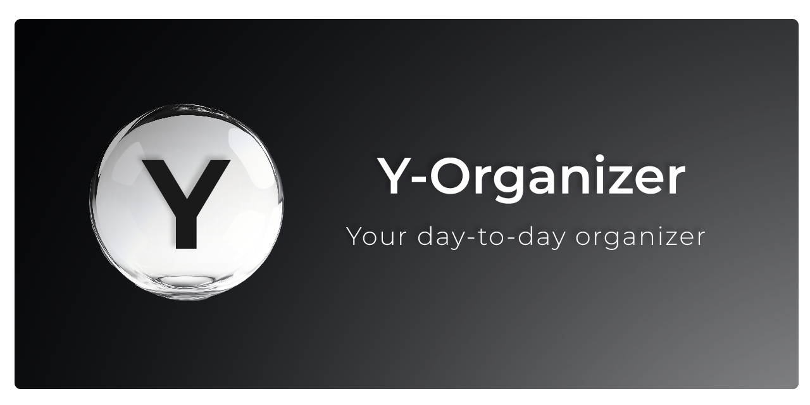
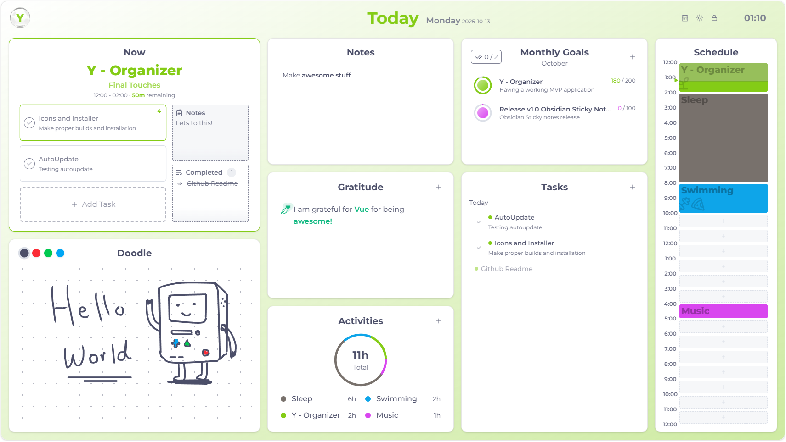
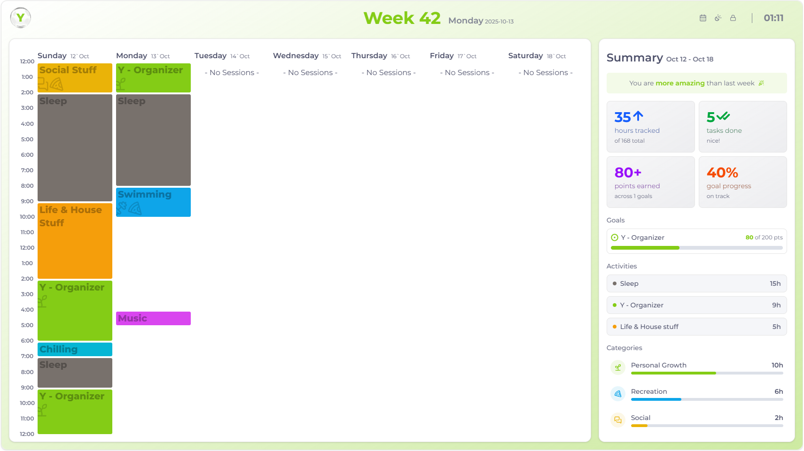
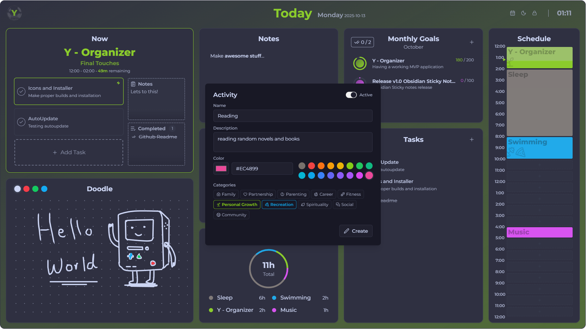
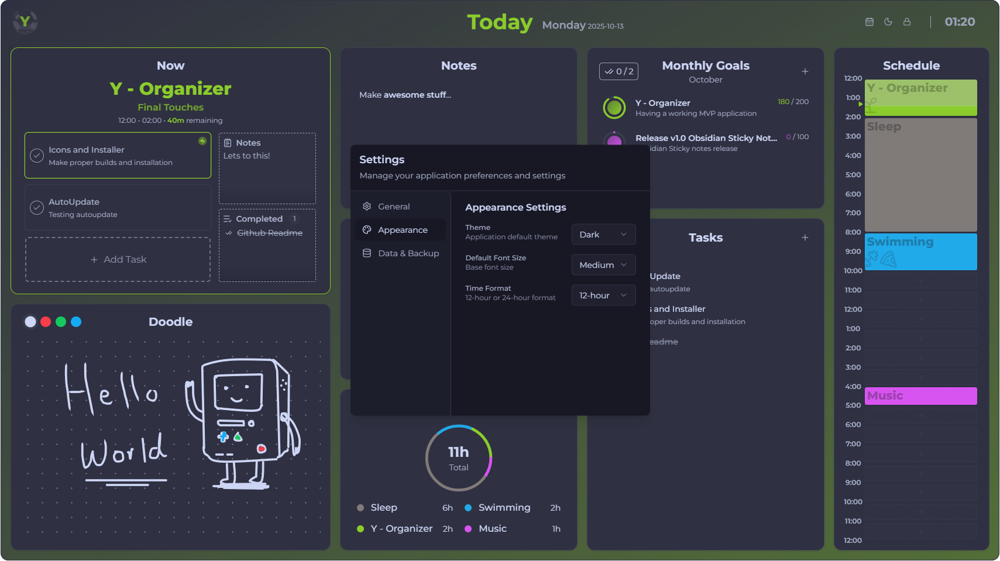

# Y-Organizer

This might look like another note-taking/to-do app, but its not really like that! 

**Y-Organizer** was simply born out of the question that I have every other night when I am about to go to sleep "_what the hell did I do today?_"

If you are anything like me, and you like to **keep track of your time**, or you tend to lose **focus** on what you are suppose to be doing right **now**, or you keep **not seeing the forest for the trees.** _Then this app might help you!_

The app is **totally free**. Its **completely offline** and requires no internet connection. All the data is yours and is stored **locally** on your pc. Also, I tried to make it as **minimal** as possible without bloat + plus its made with **tauri/rust** if that's your thing.

**Download [here](https://github.com/Abdo-reda/Y-Organizer/releases/latest) now, or visit [y-organizer.app](https://y-organizer.app/)**

> If you like the app and use it, please [reach out!](mailto:3bdo.reda@gmail.com)

## Screenshots

## Usage & Installation

> Download [here](https://github.com/Abdo-reda/Y-Organizer/releases/latest) now, or visit [y-organizer.app](https://y-organizer.app/)

There are a lot of **shortcuts that exist and some hidden functionality**, while this affects accessibility. It also keeps the design clean and without buttons everywhere. (there will be a setting for this soon hopefully!)

The main things to know is generally...
- ctrl + left click ---> edits an item
- alt + left click --> alters status if available
- right click --> clears/deletes/archives an item
- alt + right click --> permenantly delete an item

while its confusing... these shortcuts are still a **work in progress**, and are mainly there for me. However, its still crucial if you want to use the application.. so yeah, **if you face any issues** or have an idea of how this can be improved, please [reach out!](https://github.com/Abdo-reda/Y-Organizer/issues/new)

Also finally, some cards have a **hidden second page** if you swipe to the right!

## Contributions

**Everything is welcome and Anything helps!**

You can create **issues**, suggest **new ideas**, report **bugs**, make **pull-requests**, fork and create a better **clone**, even something as simple as just **reaching out** and saying what you like and dislike about it. 

_You can email me at [3bdo.reda@gmail.com](mailto:3bdo.reda@gmail.com)_

## Future Plans/Ideas

**Features & Enhancements**
- Backup functionality
- Sync functionality
- Summary Card -- Now card become a summary card in other days.
- Sounds & Audio -- Simple feedback & maybe toasts and sonnets
- Autostartup?
- Minimal & Accessibilty modes
- Better handling of loading...
- Add toasts/sonnets
- Add ability to zoom in schedule and control things up to 10+ minutes
- Activites could have icons, you pick one of the many icons.... could be neat, but annoying
- Mobile & Web versions?
- Focusable cards? each card can be focused, and any shorcuts that are relevant to that card will be active... like a pomodoro card, or a doodle card... and so on... ctrl+d for example will always create a new entity depending on the card.
- App size optimizations https://tauri.app/concept/size/

**Cards**
- Reflections/learnings card
- Pomodor card
- Game of life card
- Pomodor card
- Snake card
- Breathing card
- Screen savers and windows screen saver card
- Events & Reminder? integration with calendars? not sure... but we will need something like this.
- What if gratitude card was a growing your own plant card, the more you add gratitudes the more it grows, and then you can compare every day "plant", sometimes you can grow a tree if you have enough gratitudes..., every plant color depends on the category of gratitude

## Technical Info

**Tech stack**
- The app is created using a mix of the technologies I love
    - `tuari` + `rust`
    - `vue` + `tailwind` + `shadcn vue`

___
**Generating Icons** 
- `bun run tauri icon resources/y-logo.png`

___
**General Data Flow**
- [READ] component asks / "fetches" data from <--> "store/composable" <--> service <--> tauri 
- [WRITE] component updates --> store updates locally and calls --> service

___ 
**Creating a Release**
- Bump Version.
- Commit & Push Code.
- Edit and Publish Release Notes on Github.

## Random Ramblings

Now, I will be honest, it could be a **bit too much** to keep track of what you do everyday. Your goals, your tasks, and activities in your life. It might **backfire**, and end up making you more worried about how you spend your time and whether you are spending it on the right things. As a result, you might end up getting **stunlocked**... not sure what exactly should you be doing next. Feeling like there is not enough time to do the things you want, or doing things with worry and stress all the time that it feels like you were better of not doing them to begin with. This can lead to just overall a terrible day and a pretty **negative feedback loop/cycle**. Which is quite **opposite of what the app is TRYING TO DO!**

So.. how can you prevent this from happening? I am not sure. I am still discovering this myself. Does the app help with preventing this cycle? maybe... Its too soon to tell. In theory, some of the cards should help. The most important thing to keep in mind in my opinion, is to experiment and keep track of what works and what doesn't work. It can be difficult to figure this out at first, as it may seem very random. And it might as well be... but people say its not. So lets hope there is some order to this chaos.